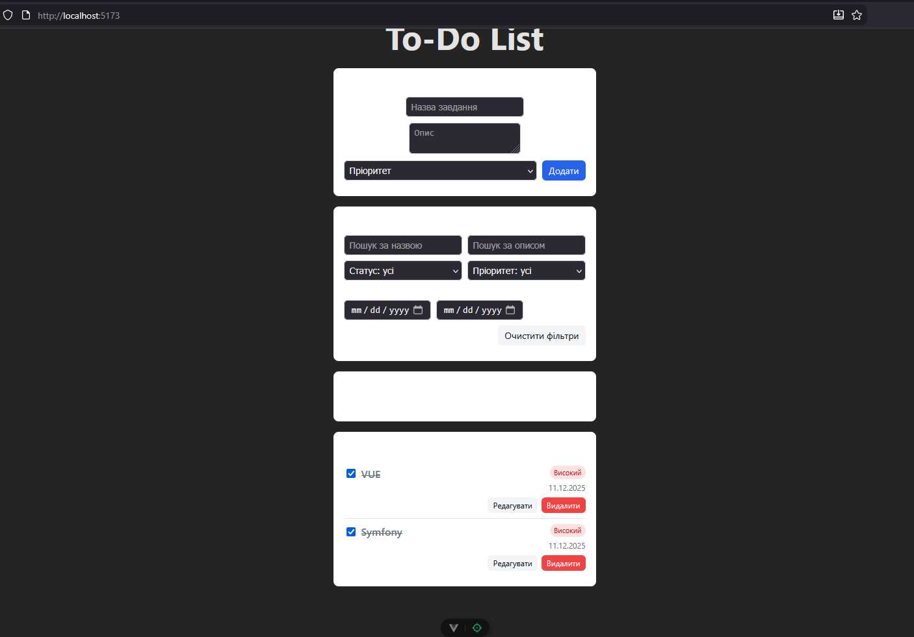
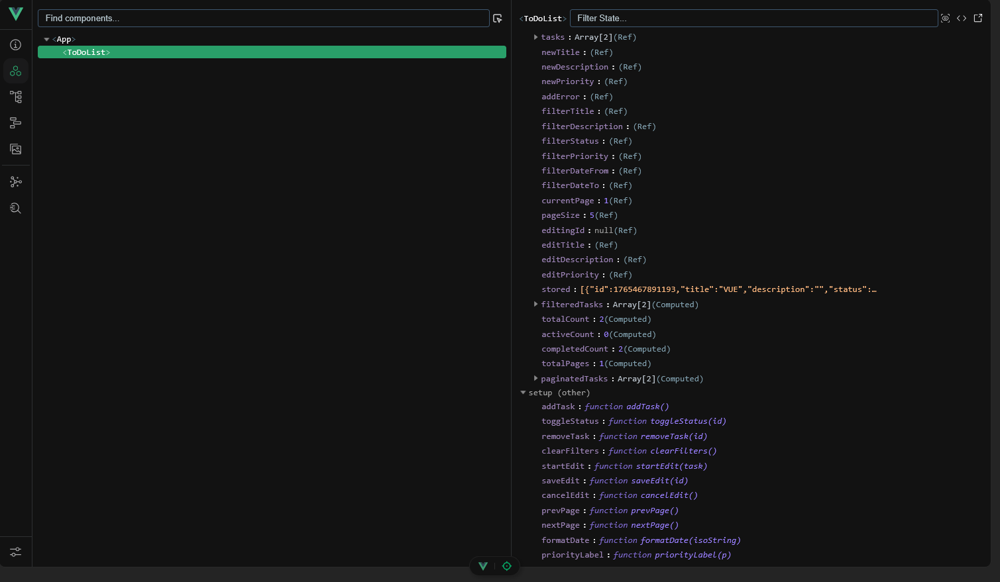
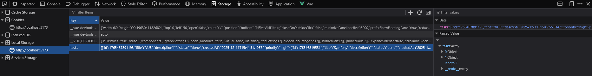

## Функціональні можливості застосунку

Застосунок реалізує базовий менеджер задач (To-Do list) з підтримкою CRUD-операцій, фільтрації, пагінації та збереження даних у LocalStorage.

Основний функціонал:

- **Створення задачі**  
  Користувач може додати нову задачу, вказавши:

  - назву (`title`),
  - опис (`description`),
  - пріоритет (`priority`: low / medium / high).  
    Виконано мінімальну валідацію: задача не додається без назви та вибраного пріоритету.

- **Статус задачі (active / done)**  
  Для кожної задачі можна переключати статус між:

  - `active` – активна задача,
  - `done` – виконана задача.  
    Статус змінюється за допомогою чекбокса, а стиль відображення задачі оновлюється (перекреслений текст для виконаних).

- **Редагування задачі**  
  Користувач може:

  - перейти в режим редагування для конкретної задачі,
  - змінити назву, опис та пріоритет,
  - зберегти зміни або скасувати редагування.

- **Видалення задачі**  
  Для кожної задачі доступна кнопка «Видалити», яка прибирає її зі списку.

- **Фільтрація задач**  
  Передбачено кілька фільтрів:

  - за назвою (`title`),
  - за описом (`description`),
  - за статусом (`status`: active / done / усі),
  - за пріоритетом (`priority`),
  - за діапазоном дат створення (`createdAt` від / до).  
    Є окрема кнопка для повного скидання фільтрів.

- **Лічильники задач (computed)**  
  Обчислювані значення показують:

  - загальну кількість задач,
  - кількість активних задач,
  - кількість виконаних задач.  
    Значення автоматично оновлюються при будь-якій зміні списку.

- **Пагінація списку**  
  Список задач розбитий на сторінки. Користувач може:

  - переходити між сторінками («Назад» / «Вперед»),
  - змінювати кількість задач на сторінці (5 / 10 / 20).  
    Пагінація працює поверх відфільтрованого списку.

- **Збереження у LocalStorage (watch)**  
  Список задач зберігається у `LocalStorage` в ключі `tasks`.

  - При старті застосунку виконуються спроба зчитати список задач з `LocalStorage`.
  - При будь-якій зміні списку спрацьовує `watch` з параметром `deep: true`, і оновлений список знову записується в `LocalStorage`.

- **Зручний інтерфейс**  
  Інтерфейс організований у вигляді карток: блок створення задачі, блок фільтрів, блок статистики та список задач з кнопками дій.  
  Використані стандартні HTML-елементи (input, select, textarea, button) з базовим оформленням для комфортної роботи.

Рис. 1 – Головний інтерфейс застосунку To-Do з формою додавання, фільтрацією та списком задач

Рис. 2 – Компонент ToDoList у Vue DevTools: реактивний стан (ref) та список задач (tasks)

Рис. 3 – Збереження списку задач у LocalStorage (ключ tasks)
