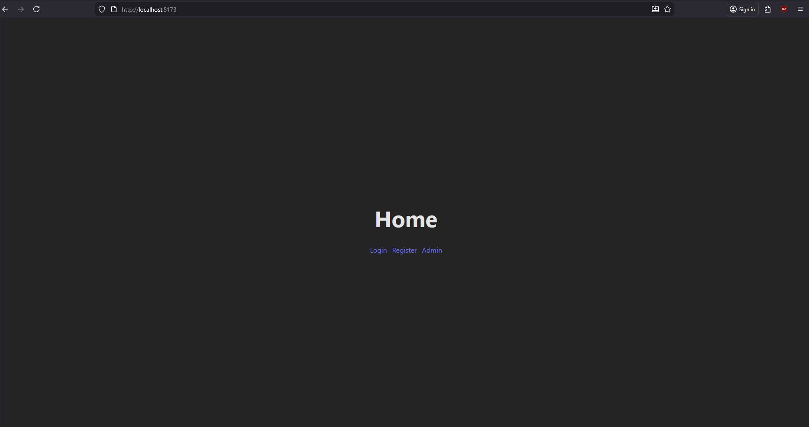
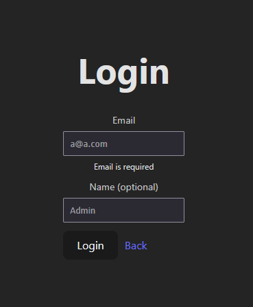
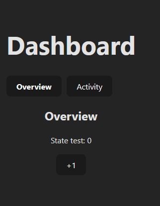
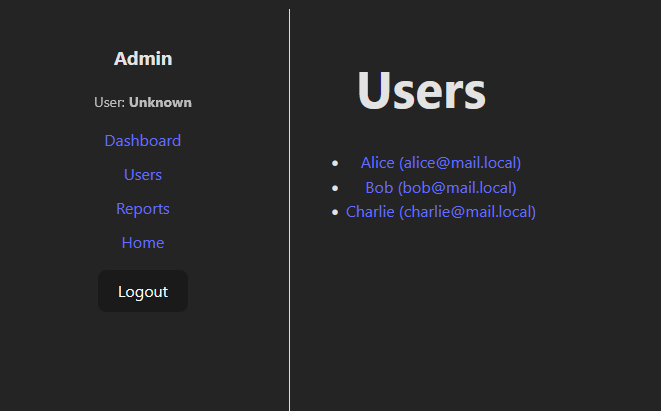
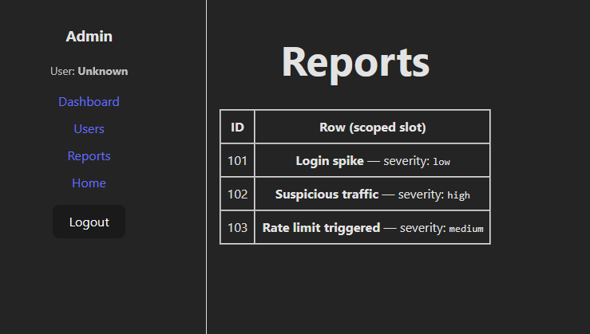

# Vue 3 + TypeScript + Vite

This template should help get you started developing with Vue 3 and TypeScript in Vite. The template uses Vue 3 `<script setup>` SFCs, check out the [script setup docs](https://v3.vuejs.org/api/sfc-script-setup.html#sfc-script-setup) to learn more.

Learn more about the recommended Project Setup and IDE Support in the [Vue Docs TypeScript Guide](https://vuejs.org/guide/typescript/overview.html#project-setup).

# Лабораторна робота №2

## «Взаємодія між компонентами та роутинг у Vue.js»

**Дисципліна:** Vue.js
**Виконав:** Закревський Сергій

---

## Мета роботи

Розробити односторінковий застосунок (SPA) на **Vue 3** з використанням **Vue Router 4**, реалізувати взаємодію між компонентами, захищені маршрути адмін-панелі, слоти (в т.ч. scoped slot), `provide/inject` та кешування стану компонентів через `KeepAlive`.

---

## Використані технології

- **Vue 3** (Composition API)
- **Vite**
- **TypeScript**
- **Vue Router 4**
- **localStorage** (імітація авторизації)

---

## Реалізований функціонал

### 1) Маршрутизація (Vue Router 4)

Налаштовано `createWebHistory()`, а також:

- `scrollBehavior()` — прокрутка до верху при переході
- `linkActiveClass` — клас активного посилання

Реалізовані маршрути:

- `/` — Home
- `/login` — Login
- `/register` — Register
- `/admin/dashboard` — Dashboard
- `/admin/users` — Users
- `/admin/users/:id` — User details (динамічний маршрут)
- `/admin/reports` — Reports
- `/:pathMatch(.*)*` — 404 Not Found

---

### 2) Захищені маршрути (Route Guard)

Для адмін-розділу `/admin/*` встановлено `meta.requiresAuth: true` та реалізовано `router.beforeEach()`:

- якщо користувач **не авторизований**, то при переході на `/admin/*` виконується редирект на:
  - `/login?redirect=<початковий_маршрут>`
- якщо користувач **авторизований** і переходить на `/login` або `/register` — виконується редирект на `/admin/dashboard`

---

### 3) Імітація авторизації

Створено `src/services/auth.ts`, де реалізовано:

- `login()` — створення токена та збереження даних користувача
- `logout()` — очищення даних авторизації
- `isAuthenticated()` — перевірка наявності токена
- `getUser()` — отримання користувача

Дані авторизації зберігаються в **localStorage**:

- `lab2_token`
- `lab2_user`

---

### 4) Взаємодія компонентів та v-model (defineModel)

Створено компонент **BaseInput** з реалізацією:

- `v-model` через `defineModel()`
- props: `label`, `type`, `placeholder`, `error`

Компонент використано у формах Login/Register.

---

### 5) Слоти та scoped slot

Реалізовано слоти:

1. **FormWrapper**:

- `default` — контент форми
- `actions` — кнопки/посилання внизу форми

2. **AdminLayout**:

- slot `sidebar` — можливість замінювати/розширювати меню адмін-панелі

3. **ReportTable**:

- **scoped slot** `#row="{ item }"` — кастомний рендер рядків таблиці звітів

---

### 6) provide / inject

У `main.ts` реалізовано:

- `provide("auth_user", getUser())`

У `AdminLayout` реалізовано:

- `inject("auth_user")` — відображення даних поточного користувача (ім’я або email)

---

### 7) KeepAlive

На сторінці `Dashboard` реалізовано вкладки:

- `Overview`
- `Activity`

Стан вкладок кешується через:

- `<KeepAlive :include="..." :max="2">`

## Встановлення та запуск

### Встановлення залежностей

```bash
npm install
```

## Скріншоти

### 01) Home

головна сторінка з навігацією на Login/Register/Admin.  


### 02) Login форма (FormWrapper + BaseInput)

форма логіну, поля зроблені через компонент `BaseInput` (v-model/defineModel) в обгортці `FormWrapper` (slots).  


### 03) Dashboard + KeepAlive

вкладки Overview/Activity; стан зберігається при перемиканні (KeepAlive).  


### 04) Users

список користувачів та перехід на деталі.  


### 05) Reports (Scoped Slot)

**Що показано:** таблиця Reports з кастомним рендером рядка через `#row="{ item }"`.  

