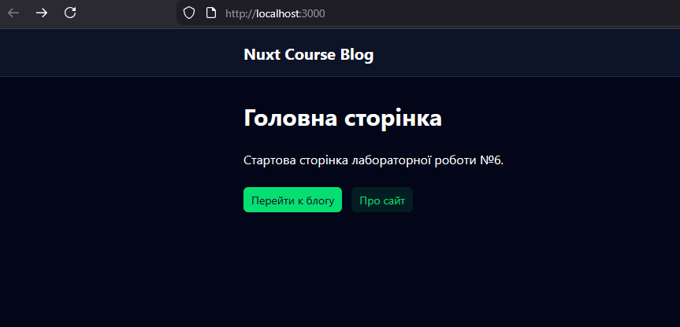
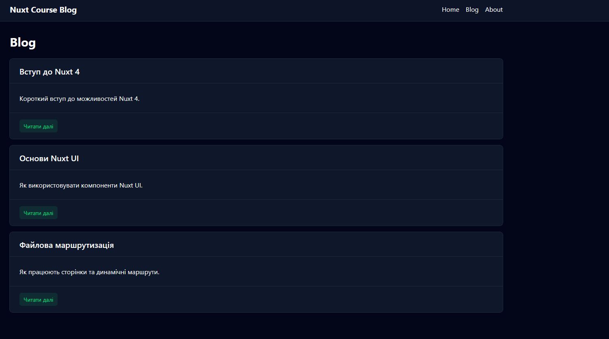

# Lab 6 - Nuxt Course Blog

Навчальний mini-blog на **Nuxt 4** з використанням **Nuxt UI**, **useFetch**, server API, dynamic routes, sitemap та robots.

# Nuxt Minimal Starter

Look at the [Nuxt documentation](https://nuxt.com/docs/getting-started/introduction) to learn more.

## Setup

Make sure to install dependencies:

```bash
# npm
npm install

# pnpm
pnpm install

# yarn
yarn install

# bun
bun install
```

## Development Server

Start the development server on `http://localhost:3000`:

```bash
# npm
npm run dev

# pnpm
pnpm dev

# yarn
yarn dev

# bun
bun run dev
```

## Production

Build the application for production:

```bash
# npm
npm run build

# pnpm
pnpm build

# yarn
yarn build

# bun
bun run build
```

Locally preview production build:

```bash
# npm
npm run preview

# pnpm
pnpm preview

# yarn
yarn preview

# bun
bun run preview
```

Check out the [deployment documentation](https://nuxt.com/docs/getting-started/deployment) for more information.

## Screenshots

### 1. Головна сторінка


_Рисунок 1 – Головна сторінка застосунку Nuxt Course Blog._

### 2. Сторінка блогу


_Рисунок 2 – Список статей на сторінці Blog._
